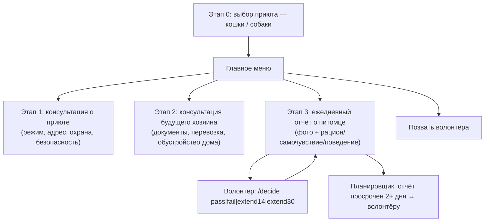

# PriutBot — Telegram-бот для приюта кошек и собак


Telegram-бот на Java (Spring Boot + PostgreSQL), который ведёт посетителя от выбора приюта до
консультации, оформления животного и ежедневных отчётов о его самочувствии в новом доме. Разработан
как дипломный проект курса Java-разработки.

## Как это выглядит



## Возможности (по этапам)

- **Этап 0.** Выбор приюта (кошки/собаки) и главное меню: информация о приюте, как забрать животное,
  прислать отчёт, позвать волонтёра. Каждое новое обращение начинается заново с выбора приюта.
- **Этап 1.** Консультация: о приюте, режим работы и адрес, пропуск на машину (охрана), техника
  безопасности, приём контактов для связи.
- **Этап 2.** Консультация потенциального хозяина: правила знакомства с животным, список документов,
  рекомендации по перевозке и обустройству дома (щенок/котёнок, взрослое животное, животное с особыми
  потребностями), советы кинолога и рекомендованные кинологи (только для собак), причины отказа, приём
  контактов.
- **Этап 3.** Ежедневный отчёт о питомце: фото + текст (рацион, самочувствие, изменения в поведении) —
  можно прислать в любом порядке, бот попросит недостающую часть. Волонтёр может отправить хозяину
  стандартное предупреждение о плохо заполненном отчёте (`/warn`) и принять решение по итогам
  испытательного срока — пройден / продлён на 14 или 30 дней / не пройден (`/decide`).
- Кнопка **«Позвать волонтёра»** доступна на любом шаге и уведомляет всех волонтёров.
- Ежедневная автоматическая проверка (по расписанию) предупреждает волонтёров, если хозяин не
  присылал отчёт более 2 дней, и напоминает, когда у кого-то закончился испытательный срок —
  окончательное решение при этом всегда принимает человек, а не бот.

## Технологии

Java 17, Spring Boot 3.1, Spring Data JPA, PostgreSQL, [Telegram Bots Java library](https://github.com/rubenlagus/TelegramBots) (long polling).

## Настройка

### 1. База данных

Создайте отдельную базу и пользователя (не используйте главный пароль `postgres`):

```sql
CREATE USER priut_bot_app WITH PASSWORD 'придумайте_свой_пароль';
CREATE DATABASE priut_bot OWNER priut_bot_app;
```

### 2. Токен Telegram-бота

1. Откройте в Telegram чат [@BotFather](https://t.me/BotFather).
2. Отправьте `/newbot`, укажите имя и username бота (username должен заканчиваться на `bot`).
3. BotFather пришлёт токен вида `123456789:AAExampleTokenValue`.

### 3. Переменные окружения

```
BOT_TOKEN=<токен от BotFather>
BOT_USERNAME=<username бота, без @>
VOLUNTEER_CHAT_IDS=<chat id волонтёров через запятую>
SPRING_DATASOURCE_URL=jdbc:postgresql://localhost:5432/priut_bot
SPRING_DATASOURCE_USERNAME=priut_bot_app
SPRING_DATASOURCE_PASSWORD=<пароль из шага 1>
```

Свой chat id можно узнать, написав боту [@userinfobot](https://t.me/userinfobot).

### 4. Запуск

```bash
mvn spring-boot:run
```

## Команды волонтёра

Доступны только тем, чей chat id указан в `VOLUNTEER_CHAT_IDS`.

| Команда | Назначение |
|---|---|
| `/newowner <chatId>` | Зарегистрировать нового хозяина, запустить испытательный срок (30 дней) |
| `/pending` | Список активных новых хозяев: статус, дата окончания срока, дата последнего отчёта |
| `/warn <clientId>` | Отправить хозяину стандартное предупреждение о плохо заполненном отчёте |
| `/decide <clientId> pass\|fail\|extend14\|extend30` | Решение по испытательному сроку |

`clientId` — внутренний числовой ID из `/pending`, `chatId` — идентификатор чата пользователя в Telegram.

## Важно перед реальным использованием

Тексты консультаций (адрес, режим работы, правила, документы и т.д.) в
[`ContentProvider`](src/main/java/com/example/priutbot/content/ContentProvider.java) — это
заготовки с пометками `[укажите ...]`. Замените их реальными данными вашего приюта перед запуском
для настоящих пользователей.

## Лицензия

Проект распространяется под лицензией MIT — см. [LICENSE](LICENSE).
